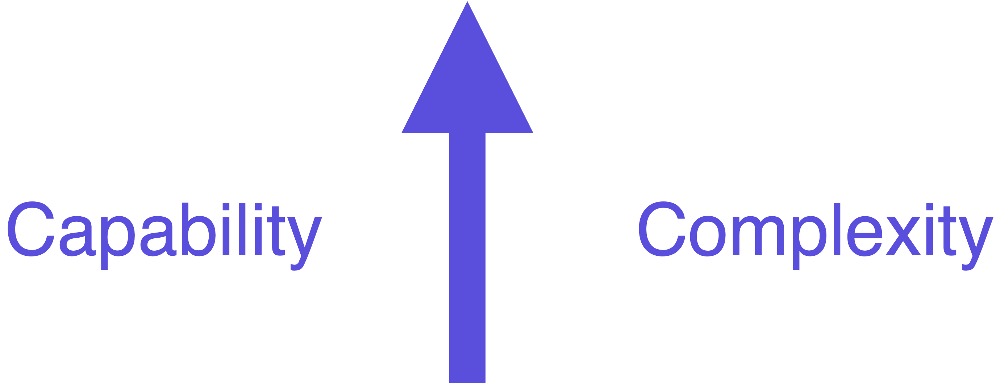
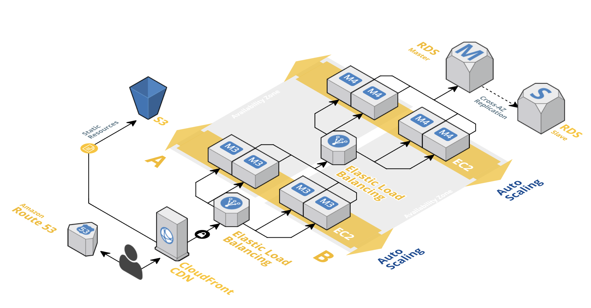
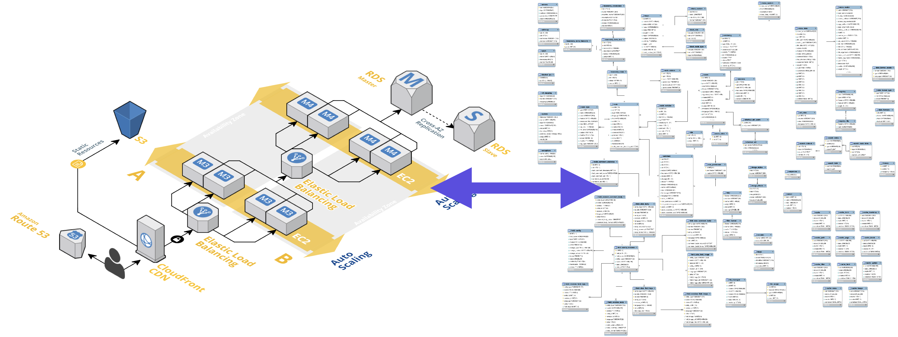
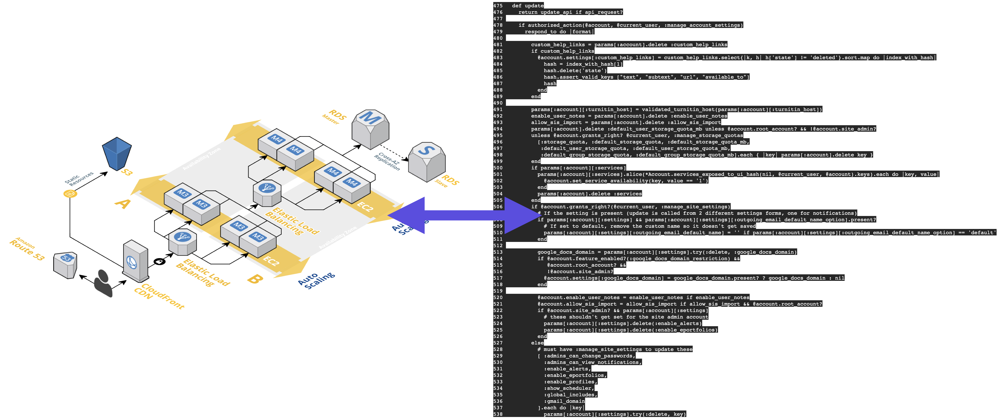
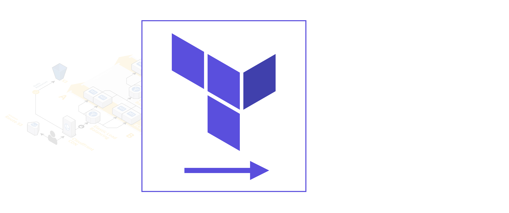
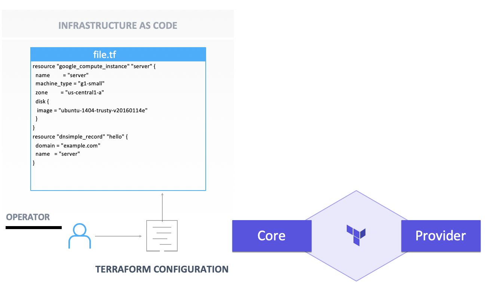

name: tf-foundations-1
class: title, smokescreen, shelf
background-image: url(https://hashicorp.github.io/field-workshops-assets/assets/bkgs/HashiCorp-Title-bkg.jpeg)
count: false

# Teraform Cloud Technical Enablement
## Terraform Foundations


---
layout: true

background-image: url(../images/bkgs/HashiCorp-Content-bkg.png)
background-size: cover

.footer[

- Copyright © 2021 HashiCorp
]

---
name: slide-deck
exclude: true
class: img-right-full


<br><br><br>
.center[
Follow along at this link:

## https://g
]

???
TODO: Update the shortcut link to this slide deck

---
name: agenda
# Table of Contents

<div>
1. **Workshop Agenda**
2. **Introduction to Terraform**
3. **How Terraform Works**
4. **Terraform Basics**
5. **Intermediate Terraform**
6. **Version Control**
<div>

---
name: what-is-this-course
class: title, smokescreen, shelf
background-image: url(https://hashicorp.github.io/field-workshops-assets/assets/bkgs/HashiCorp-Title-bkg.jpeg)
count: false

# Terraform Cloud Technical Enablement
## Course Agenda


---
name: course-agenda-1
class: compact
# Agenda

- Terraform Foundations Introduction
- **Introduction to Terraform**
  * Why Change?
  * What is Infrstructure as Code?
  * What is a Version Control System (VCS)?
  * Why Terraform vs. other tools?
- **How Terraform Works**
  * Community + Plugin Model
  * Providers
  * State & Remote backends
  * Terraform Workflow

---
name: course-agenda-2
class: compact
# Agenda
- **Terraform Basics**
  * HashiCorp Configuration Language (HCL)
  * Data Sources vs. Resources
  * Variables
  * Outputs
  * Interpolations
  * Provisioners -- To be removed.
  * Provider authentication
  * Terraform CLI

---
name: course-agenda-3
class: compact
# Agenda
- **Intermediate Terraform**
  * Modules
  * Functions
  * Locals

---
name: why-change
class: title, smokescreen, shelf
background-image: url(https://hashicorp.github.io/field-workshops-assets/assets/bkgs/HashiCorp-Title-bkg.jpeg)
count: false

# Why Change?
## A History of Infrastructure


---
name: infrastructure-maturity
class: compact
# Maturity

.center[

]

???
Infrastructure has been around for a very long time

---
name: manual-everything
class: compact
# Manual Everything

.center[

]

???
Many years ago, everything as done manually - buy or lease a physical server, get it installed in a datacenter. Provision it by installing the operating system and software/applications needed. Patch and update it by logging in with SSH.

---
name: basic-automation
class: compact
# Basic Automation

.center[

]

???
Basic automation was achievable through scripting and programming languages like bash and python, but resource utilization was low and costs were high.

---
name: machine-virt
class: compact
# Machine Virtualization

.center[

]

???
Machine virtualization and hypervisors came along and allowed us to run multiple computers on the same host, increasing resource utilization and decreasing acquisition time

---
name: *aas
class: compact
# *aaS

.center[

]

???
Seeing the value in infrastructure as a service, cloud providers began to form, standards emerged, and compute is at our fingertips. Providers offer various types of

---
name: datacenter-as-comp
class: compact
# Data Center as Computer

.center[

]

???
We are currently in the era of container engines and schedulers like docker, nomad, and k8s - tools which allow us to reach close to resource maximization and allow for dynamic scale and isolation.

---
name: maturity-arrow
class: compact
# Maturity

.center[

]

???
We have evolved so much since the inception of computers, you would think we have reached zen by now... But in fact, it's incredibly painful.

---
name: capability-complexity
class: compact
# With Capability Comes Complexity

.center[

]

???
As we add more and and more functionality (capability), we add more complexity

---
name: app-infra
class: compact
# A Typical Application
.center[

]

???
Our infrastructure has gotten really complex. This diagram shows a typical two tier web application.

---
name: infra-erd
class: compact
# Models like an ERD
.center[

]
???
It turns out that modeling the relationships between these resources is actually very similar to a relational database (the right is an Entity Relationship Diagram)

---
name: infra-db-code
class: compact

.center[

]
???
And we already have techniques for modeling databases as code... so why can't we model infrastructure as code?

---
name: terraform-iac
class: compact

.center[

]
???
That's where Terraform comes in.

---
name: what-is-iac
class: compact
# What is Infrastructure as Code?

Infrastructure as Code (IaC) is the process of managing and provisioning  infrastructure with machine-readable definition files.

---
name: iac-allows-us-to
class: compact
# Infrastructure as Code Allows Us To...

* Provide a codified workflow to create infrastructure
* Change and update existing infrastructure
* Provide reusable modules for easy sharing and collaboration
* Safely test changes using **`terraform plan`** in dry run mode
* Enforce security policy and organizational standards
* Enable collaboration between different teams
* Integrate with application code workflows (Git, CI/CD tools)
???
one of the primary goals of IaC is to provide a repeatable workflow for creating and managing infrastructure.

IaC also provides the ability to safely manage updates to existing infrastructure components.

IaC promises to bring the same tools and techniques of application development (SCM, code review, etc) to infrastructure management.

And lastly, IaC aims to expose ways to share components and separate responsibilities (modules).

---
name: terraform-is-iac
# Terraform is Infrastructure as Code

.center[

]

---
name: terraform-is-iac-2
class: compact
# It's a Codified Way to Define Your Infrastructure

```JSON
# Configure the AWS Provider
provider "aws" {
  region = "us-east-1"
}

resource "aws_vpc" "example" {
  cidr_block = "10.0.0.0/16"
}
resource aws_subnet "tflabs" {
  vpc_id     = aws_vpc.example.id
  cidr_block = "10.0.1.0/24"
}
```

---
name: what-is-terraform
class: compact
# What is Terraform?

* An infrastructure as code tool
* **Executable Documentation**
* Human and machine readable
* Easy to learn
* Test, share, re-use, automate
* Works on all major cloud providers, on premise infrastructure (VMware, Cisco, Palo Alto, F5, etc.), SaaS applications (DataDog, Okta, etc.), and 300+ more.

---
name: terraform-community
class: compact
# Terraform Community
- Terraform is a community based infrastructure as code provisioning tool.
<br>
- It is a single cross platform binary written in Go. It can run on Linux, Windows, or OS X.
<br>
- Installing Terraform is easy. You simply download a zip file, unzip it, and run it. Terraform works with files in a directory.
<br><br>
[Download Terraform](https://www.terraform.io/downloads.html)

---
name: terraform-cloud
class: compact
# Terraform Cloud
Terraform Cloud is an application that helps teams use Terraform together. Terraform Cloud:

- Manages Terraform runs in a consistent and reliable environment
- Includes easy access to shared state and secret data
- Has a robust Role Based Access system
  * Plan
  * Approve
  * Write
- Includes a private registry for sharing Terraform modules
- Includes Integrated Sentinel Workflows for policy and control

---
name: terraform-ent
class: compact
# Terraform Enterprise

Terraform Enterprise is a self-hosted distribution of Terraform Cloud. It offers enterprises a private instance of the Terraform Cloud application, with no resource limits.

.center[

]

---
name: terraform-vs-others
class: compact
# Terraform vs. Other Tools

Terraform is a Declarative Infrastructure as Code (IaC) tool.  

This means that you declare what you want the state of the world but not the how of doing that.

Imperative tools such as Ansible or AWS CLI require that you build logic to ensure the state of the world matches your desired state.  

These tools are ideal for Day 2 operations or variable changes that may need to be adjusted inconsistently between systems or applications after Terraform establishes the state of the world.

???
Good discussion points here to bring up the Better Together story around Terraform with operational tools such as Ansible or Chef.
Get information on what tools they may be using and how they are using them for where Terraform may be a good IaC fit.
 
---
name: what-is-vcs
class: img-right
# What is a Version Control System (VCS)?


Version control systems are applications that allow users to store, track, test, and collaborate on changes to their infrastructure and applications.

Terraform Cloud integrates with many common Version Control Systems.

???

---
name: multi-user-collaboration
class: compact
# User Collaboration
Users from different teams or departments can all benefit from centralized infrastructure as code.

Infrastructure changes are no longer created in isolated silos.

Each team can contribute or consume Terraform code according to their needs.

???
**When you store all your terraform code in git repos, you unlock some extra features like user collaboration. Terraform Cloud helps bring these teams closer in a more productive way.**

---
name: vcs-driven-workflow
# Automated Test Pipelines
.center[]

When your Terraform code is stored in a version control system, you unlock extra features like pull requests, code reviews and testing. Here's an example showing some tests that run on our training lab repo.

???
**Storing your code in VCS also enables you to build automated test pipelines and conduct code reviews to approve any pending changes. Multiple users can build and contribute changes to the same infrastructure as code base without stepping on one another's toes.**

---
name: everything-is-recorded
# No More Untracked Changes
.center[]

Every infrastructure change is recorded and tracked in the git log. You will always know exactly who made a change, what was changed, who approved the change, and when and why the change was made.

???
**Your auditors and security folks will like this because every change is tracked. No more mystery changes or wondering if something broke because of an untracked change.**
